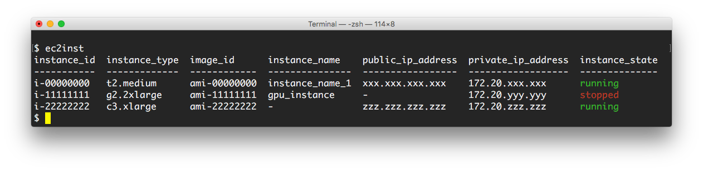

# ec2inst

`ec2inst` provides AWS EC2 instance console for CLI.



## Install

Using pip:

```
pip install git+https://github.com/yagays/ec2inst.git  
```

or from source:

```
$ git clone https://github.com/yagays/ec2inst
$ cd ec2inst
$ python setup install
```

## Usage

```
$ ec2inst -h
usage: ec2inst [-h] [-p PROFILE] [-c COLUMNS]

AWS EC2 instance console for cli

optional arguments:
  -h, --help            show this help message and exit
  -p PROFILE, --profile PROFILE
                        select profile_name in ~/.aws/credentials
  -c COLUMNS, --columns COLUMNS
                        columns to display: instance_name,instance_id,instance
                        _type,availability_zone,instance_state,instance_state_
                        code,public_dns_name,public_ip_address,private_ip_addr
                        ess,key_name,monitoring,launch_time,security_group,ima
                        ge_id
```

### Using AWS CLI credentials

If you have already use [AWS CLI](https://aws.amazon.com/cli/), you can specify your profile.

```
# use "yag_ays" profile
$ ec2inst -p yag_ays
```

### Select column to display

```
$ ec2inst -c instance_type,instance_name,instance_state
instance_type  instance_name    instance_state
-------------  ---------------  --------------
t2.medium      instance_name_1  running
g2.2xlarge     gpu_instance     stopped
c3.xlarge      -                running
```

## Author

@yag_ays <yanagi.ayase@gmail.com>
